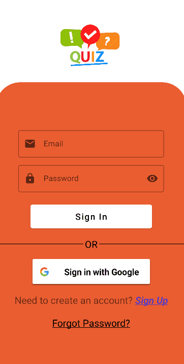

# QuizGameArc

**Quiz Game Arc** is an Android application built in Kotlin using XML layouts.

## Features

* [ ] Pulls questions from Google Firebase (a real-time, NoSQL database). Results are saved to the user's account for persistence. 
* [ ] Supports email and password sign-in, as well as Google account sign-in.
* [ ] Includes multiple activities with intents (data) passed between them. 

